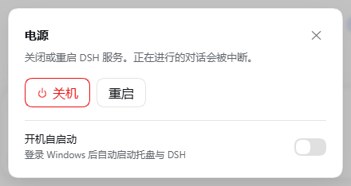
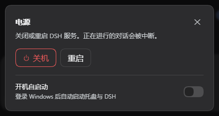
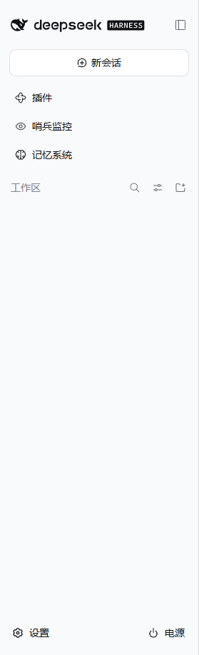

# @mostkia/dsh-launcher

Power controls for DeepSeek Harness (DSH) plus a Windows tray launcher that can
start it, restart it and show its console output.

🌏 **English** · [简体中文](./README.zh.md)

## What you get

| Part | Where it lives | What it does |
|---|---|---|
| **Power button** | DSH sidebar, in the official `sidebar.footer.action` seat right beside Settings | Opens a dialog with **Shut down** and **Restart** (each behind a second confirmation) and a **Start at logon** switch |
| **Tray launcher** | `%LOCALAPPDATA%\DSH-Launcher`, started from a desktop shortcut | Starts `dsh web`, restarts DSH when asked, and offers the same start-at-logon toggle; the output it captures stays one double-click away, with no console window in the way |

Both halves are installed by one package, but neither is welded to the other:
the tray keeps working if you remove the plugin (restart then falls back to a
hard process-tree restart), and the plugin keeps working if you never install
the tray (restart then reports that no supervisor is present and does nothing).

## Screenshots

| Power dialog, light | Power dialog, dark | Sidebar action |
|:--:|:--:|:--:|
|  |  |  |

The dialog follows the host theme because every colour, radius and shadow comes
from theme tokens. The action itself uses the shell's own sidebar foot seat, beside
Settings, and takes no row of its own.

## Install

```bash
# 1. the plugin (from GitHub; pin the release tag for reproducibility)
dsh plugin --profile web add github:mostkia/dsh-launcher#v0.1.0

# 2. the Windows tray (optional but recommended; gives you graceful restarts)
#    from the installed package directory, run:
#    tray\install.cmd            (double-click it, or run it in a terminal)
```

Then restart DSH once (`dsh web` or the existing launcher) so the new bundle is
composed, and refresh the page.

`tray\install.cmd` copies the tray into `%LOCALAPPDATA%\DSH-Launcher`, writes
`install.json` (the single source of truth both halves read) and creates a
**DSH Launcher** desktop shortcut. It never touches autostart — you opt in.

## Using it

- **Sidebar power button** → `Shut down` exits DSH gracefully (code 0);
  `Restart` exits with the restart code so the tray relaunches it. Both ask for
  a second confirmation, because the button sits within easy reach.
- **Start at logon** — the switch at the bottom of that dialog, and the
  checkable tray menu item, read and write the *same* registry value
  (`HKCU\Software\Microsoft\Windows\CurrentVersion\Run` → `DSHLauncher`), so the
  two always agree.
- **Tray icon** — double-click to read the captured console output; the menu has
  show/hide, start, restart, open DSH, open the log file, start at logon, and
  "shut down DSH and exit".

## How restart really works

The plugin never calls `process.exit` on its own:

1. The UI asks the host half to restart.
2. The host half replies `200`, then asks the launcher's **bounded shutdown
   controller** (`ctx.appExit`) to exit — the plugin tree is disposed and the
   port released first.
3. The exit code (42) is the contract: the supervisor relaunches.

A supervisor is only trusted when it says so: the tray sets
`DSH_LAUNCHER_SUPERVISED=1` on the DSH process it starts. Without that marker the
restart endpoint answers `{"ok":false,"reason":"unsupervised"}` and leaves the
process running — click-to-lose-your-session is not a feature. This is also the
one place where a hard restart can still happen: if you remove the plugin but
keep the tray, the tray's own restart falls back to `taskkill /T /F`.

## HTTP surface (for scripts and other launchers)

All endpoints reject any `Origin` that is not this machine's loopback address
(`403`) and live under the plugin's own namespace. A request without an `Origin`
header (a script, `curl`) is allowed by design: a browser always sends one on a
POST, so an absent header is what a CSRF guard should ignore — while a present one
must never be trusted just because its host matches the request's `Host`, which is
exactly the DNS-rebinding hole an earlier version had.

| Method | Path | Meaning |
|---|---|---|
| `GET` | `/_dsh-launcher/status` | platform, pid, `supervised`, autostart state |
| `POST` | `/_dsh-launcher/shutdown` | graceful exit, code 0 |
| `POST` | `/_dsh-launcher/restart` | graceful exit, code 42 (only when supervised) |
| `POST` | `/_dsh-launcher/autostart/enable` | register the logon-start entry |
| `POST` | `/_dsh-launcher/autostart/disable` | remove it |

## Testing

Both halves ship with a test that needs no real DSH session:

```bash
# host half: endpoints, guards, exit codes, autostart states (23 checks)
node test/host-half.test.mjs

# client half: slot registration and locale completeness, no browser needed
node test/client-half.test.mjs

# tray: the supervision probe and both restart paths, against a fake DSH
powershell -NoProfile -ExecutionPolicy Bypass -File test\tray-supervision.ps1
```

The tray test runs `test/fake-dsh.mjs` (a tiny HTTP server that speaks the
plugin's endpoints) as the supervised child on a scratch port, so a real DSH is
never started, killed or restarted. It pins the decisions that matter: with a
supervised child the tray asks the plugin and waits for the restart code; with an
unsupervised one it refuses to call the endpoint (which would answer `ok:false`)
and forces the restart itself; and when the port is held by something that does
not speak the plugin's status route — the plugin failed to load, or another plugin
owns the path — it says so and forces the restart instead of claiming the plugin
agreed. Inside a confined shell `taskkill` is denied, so the kill step of the
forced path cannot be observed there; the runner notes the limitation and the fake
child exits on its own instead.

Maintainers: [RELEASE.md](./RELEASE.md) carries the pre-flight checks, the
tagging steps and the optional market listing. Those suites, plus the
package-contents check, run in CI on every push and pull request
(`.github/workflows/tests.yml`).

## Requirements

- DSH **0.1.7 or newer** (uses `sidebar.footer.action`, `ctx.appExit`, and the
  `webServer` registration API).
- Node `^22.19.0 || >=24.0.0` (DSH's own requirement).
- The tray and start-at-logon are **Windows only**. The plugin itself is
  platform-neutral and reports that cleanly.

## Design notes

- **No runtime dependencies, on purpose.** Everything `@deepseek-ai/*` is a
  peerDependency, never a dependency: a package manager must never be able to
  install a second physical copy of a shared DSH package into your profile,
  because that splits private Symbols and breaks the host's scheduler lookup.
- **The client half imports nothing.** No `@deepseek-ai/dsh-client-ui-*` package
  is required; the UI is hand-built from theme tokens (`--dsw-alias-*`,
  `--dsw-radius-*`, `--dsw-shadow-*`) so it follows light/dark and the host
  design language. All visible text goes through the client locale service
  (zh + en).
- **No conflict with other plugins.** The plugin claims only its own paths and
  does not attempt to coexist with, or replace, `dsh-shutdown` at the routing
  level; each works when installed alone.

## Credit and licence

Independent implementation. The exit-code restart convention and the general
idea of a launcher cooperating with a power plugin were informed by
[dsh-shutdown](https://github.com/knlght/DSH-shutdown) (MIT); no code from it is
included here. The tray icon is derived from DSH's own front-end favicon
(`favicon.svg`) and is used to identify the launcher.

[MIT](./LICENSE) © 2026 mostkia
